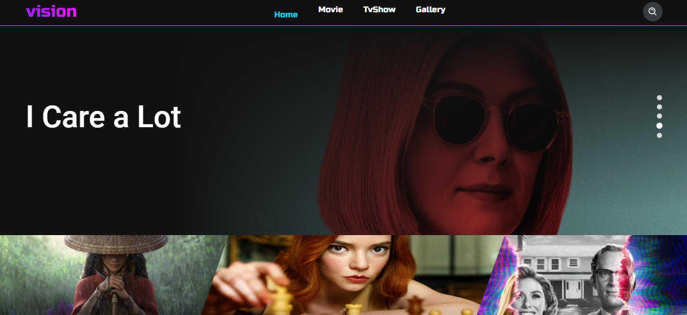

# Vision
 🎥 Um simple app com React Js

View app 
>  https://react-js-vision.vercel.app/

# Tecnologias
* [React js](https://reactjs.org/)
* [React Hooks](https://reactjs.org/docs/hooks-intro.html)
* [React Router Dom](https://reactrouter.com/web/guides/quick-start)
* [React-icons](https://react-icons.github.io/react-icons/)
* [Axios](https://github.com/axios/axios)
* [styled-components](https://styled-components.com/)
* [react-loading](https://www.npmjs.com/package/react-loading)

# Como usar

1. Clone este repositório
    * `git clone https://github.com/Josue-Js/react-js-vision`

2. obter usa api key

    * Se registrar no site [tmdb](https://www.themoviedb.org/signup)

    * registrar sua api key

3. Vá para o repositório 

    * `cd react-js-vision`

4. criar file **.env** na raiz do projeto
    
    * REACT_APP_API_KEY=SUA API KEY

5. Instalar dependências

    * `yarn install`

6. Execute o aplicativo
    * `yarn start`

